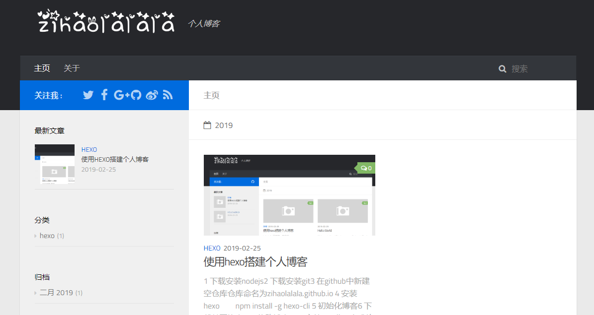
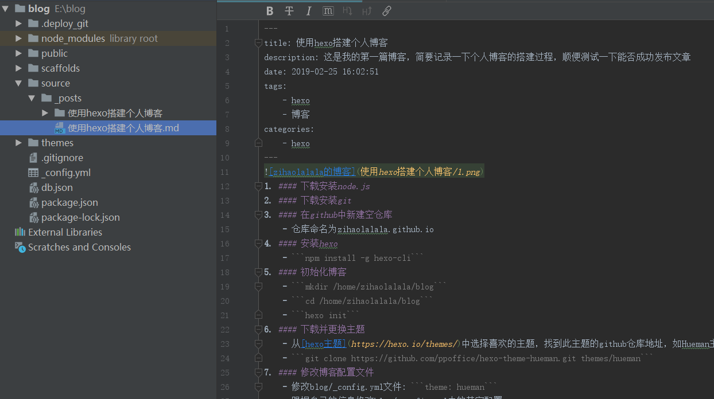
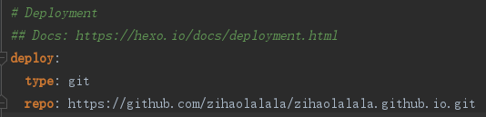

1. #### 下载安装node.js  

2. #### 下载安装git  

3. #### 在github中新建空仓库  
    仓库命名为zihaolalala.github.io  

4. #### 安装hexo  
    ```
    npm install -g hexo-cli  
    ```

5. #### 初始化博客  
    ```
    mkdir /home/zihaolalala/blog  
    cd /home/zihaolalala/blog  
    hexo init  
    npm install  
    ```

6. #### 下载并更换主题  
    - 从[hexo主题](https://hexo.io/themes/)中选择喜欢的主题，找到此主题的github仓库地址，如Hueman主题的地址: https://github.com/ppoffice/hexo-theme-hueman.git  
    ```git clone https://github.com/ppoffice/hexo-theme-hueman.git themes/hueman```  
    - 修改blog/_config.yml文件:   
        ```theme: hueman```  

7. #### 修改博客配置文件  
    - 跟据自己的信息修改blog/_config.yml中的其它配置  
    - 跟据自己的信息修改blog/themes/human/_config.yml中的配置  

8. #### 写作  
    - 新建文章命令，后面的是文章标题  
    ```hexo new 使用hexo搭建个人博客```  
    - 打开'blog/souce/_posts/使用hexo搭建个人博客'，开始写文章  
      
    
9. #### 生成静态页面  
    ```hexo g```  
    
10. #### 本地查看博客  
    - 开启本地服务器  
    ```hexo s```  
    - 访问https://localhost:4000  
    
11. #### 推送到远程仓库  
    - 安装模块  
    ```npm install -s hexo-deployer-git```  
    - 修改blog/_config.yml文件:  
      
    - 部署  
    ```hexo d```  
    
12. #### 访问博客主页zihaolalala.github.io  
