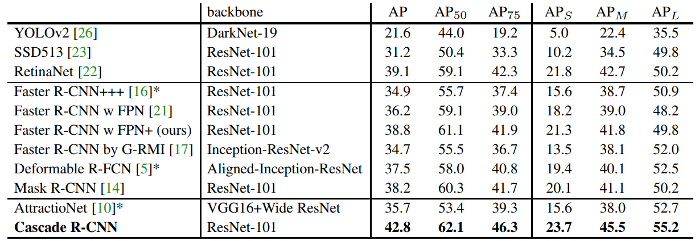

##### 1. Cascade R-CNN: Delving into High Quality Object Detection   
- 在 COCO test-dev 数据集上对比多个 state-of-the-art 单模型目标检测器. (The entries denoted by * used bells and whistles at inference)  

- 在多个流行 baseline object detectors 中使用 cascade 的效果对比（检测速度为单张图片在单个Titan XP GPU上计算的时间）  
